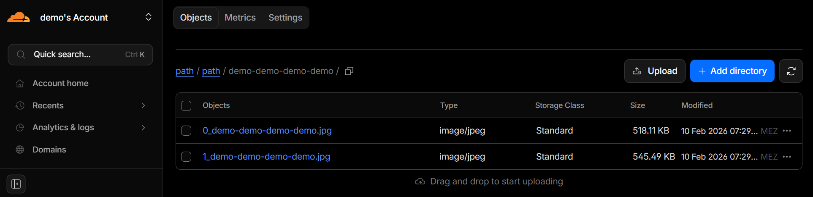
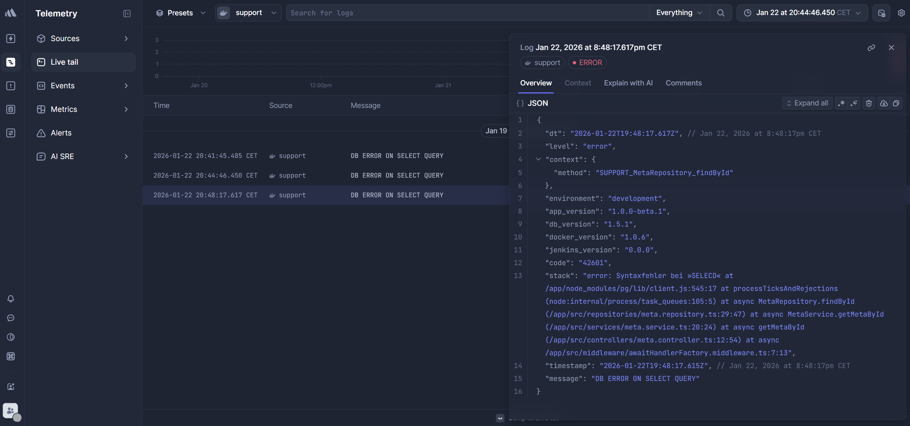
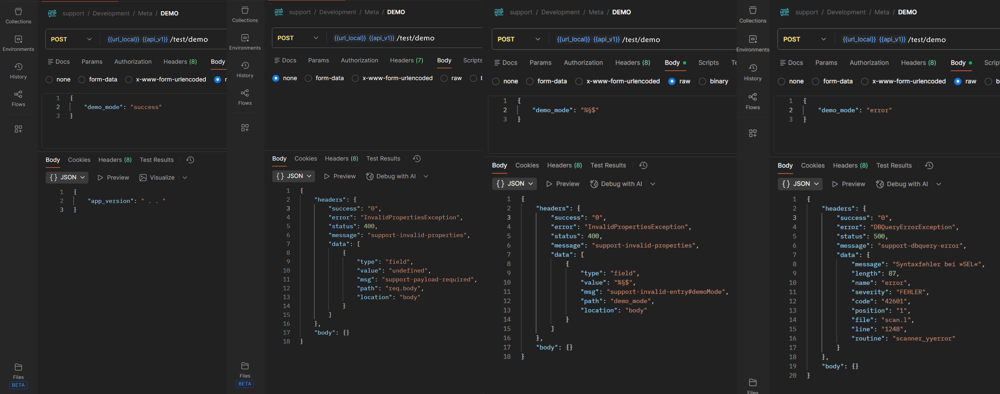
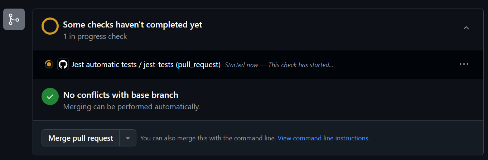
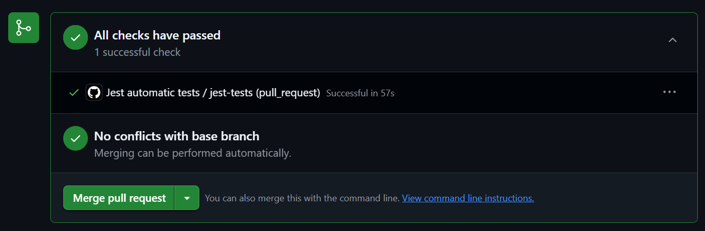

# yqni13 | support
$\texttt{\color{teal}{v1.3.1}}$


<br>

<div>
    
</div>

### Technology

<div style="display:flex; align-items:center;">
    
    
    
    
</div>
<div style="display:flex; align-items:center;">
    
    
    
</div>
<div style="display:flex; align-items:center;">
    
    
    
</div>

<br>

## How to

### Build & Deploy
This application server will is hosted by <a href="https://render.com/">Render</a> in a Docker container and a PostgreSQL database hosted by Neon. Additionally a <a href="https://console.cron-job.org/">cron-job</a> is set up to keep the service alive on Render due to 15-min inactivity on free tier plan.<br>
The development process is structured by the TDD (test driven development) principle.

<br>

## Overview

### $\textsf{\color{teal}Features}$

<dl>
    <dd>🪲 support/bug/feedback-ticket handling including client + user data</dd>
    <dd>📂 file handling (upload/delete) from requests + cloud storage</dd>
    <dd>:mag: filtered search for ticket + user data (properties + timespan)</dd>
    <dd>:closed_lock_with_key: en/disable application (maintenance mode) triggered by request/logic</dd>
    <dd>:key: request verification by api-keys</dd>
    <dd>🕵️ request rate limiting + violation handling</dd>
</dl>

<br>

### $\textsf{\color{teal}File handling}$

User can attach files for any support/bug ticket to provide further information (screenshots, images, ...) on their message. Attachments are limited to upload up to `5` files and each file can be up to `1`mb [see validation](./backend/src/middleware/files/validate.files.middleware.ts). Currently only `images` (webp, jpg, jpeg, png) and `pdf` files are supported, but more will follow. Cloud in use is `Cloudflare` (see Figure 1) using S3Client for api communication and files will be deleted when a ticket is closed, canceled or expired (time check).
<div align="center">
    
    Figure 1 - Cloudflare upload demo, v1.0.0
</div>

<br>

### $\textsf{\color{teal}Logging}$

To monitor errors the logging framework `Winston` is used in combination with Logtail from `Betterstack` as a Singleton: [config](./backend/src/logger/config.logger.ts)
<br>While working within local (DEV) or test environment, error messages are logged into the consoles. For the deployed environments (STAG/PROD) the logging is set to send logtails to Betterstack (longer storage time than app-hosting service). For easy access and monitoring of error messages, the Betterstack UI client dashboard comes in handy (see Figure 2). Additional meta data (environment + version numbers) help identifying and assigning errors.
<div align="center">
    
    Figure 2 - Betterstack logging dashboard, v1.0.0-beta.1
</div>

<br>

## Testing

### $\textsf{\color{teal}Demo}$

Testing of the application server can be done automatically via Jest tests (next chapter) or manually by a separate demonstration route.<br>POST: `/test/demo`<br>using the body payload to control the response - use the demo route to get exceptions, info message or the current application version number. With the implemented observation middleware, the demo route will be limited to 20 daily requests. As the demo route is not authenticated, you only need the following data:
```sh
[ROUTE] {{url}}/api/v1/test/demo
[PAYLOAD] { "demo_mode": string }
```
Use `https://support-0hsq.onrender.com` for {{url}} to test on live conditions.<br>
See Figure 3 for the different use cases & responses (Postman, v11.73.5) - from left to right:
<br>[PAYLOAD]: { "mode_enum": "success" } => retrieve current version number as request without fail
<br>[PAYLOAD]: undefined (none) or empty obj/array => retrieve exception for undefined body
<br>[PAYLOAD]: { "mode_enum": "%§$" } => retrieve exception due to invalid value
<br>[PAYLOAD]: { "mode_enum": "error" } => retrieve exception for intended failing db query (see data.message: SEL instead of SELECT)
<div align="center">
    
    Figure 3 - /test/demo responses, v1.3.1
</div>

<br>

POST: `/test/error`<br>
Additionally, the /test route includes a request to manually throw existing exceptions selected by the payload.<br>This route is intended for testing purposes only like UI translations. Therefore, `error` property targets the exception and the optional `errorMsg` controls the message output on certain exceptions.
```sh
[ROUTE] {{url}}/api/v1/test/error
[PAYLOAD] { "error": string, "errorMsg"?: string }
```


<br>

### $\textsf{\color{teal}Jest}$

Added `jest` testing framework to project providing unit tests and integration tests for the `backend`.<br>
Install the packages `@jest/globals`, `@types/jest`, `supertest`, `@testcontainers/postgresql` and `testcontainers` additional to `jest`:
```sh
npm install jest @jest/globals @types/jest supertest @testcontainers/postgresql testcontainers --save-dev
```
350+ tests exist currently for models, utils, validators and workflows (integration tests) - see [tests](./backend/tests).<br>
Run tests on local device by including setup for dotenv/config to provide environment variables:
```sh
set NODE_ENV=test && jest --setupFiles dotenv/config
```
or simply save as script command in `package.json` to run `npm test`:
```sh
"scripts": {
    "start:dev": "ts-node --files src/server.ts",
    "test": "set NODE_ENV=test && jest --setupFiles dotenv/config"
}
```

<br>

To automatically check tests before merging feature/development branch further up, a `GitHub Action` is set up, see [main.yml](.github/workflows/main.yml).<br>
Preventing an unwanted merge with unfinished/failed test run, the project is set up to disable merging until all tests have passed (see Figure 4 to Figure 5).

<div align="center">
    
    Figure 4 - processing tests, v0.9.1
</div>
<br>
<div align="center">
    
    Figure 5 - passing tests, v0.9.1
</div>

<br>

## Updates
[see changelog for all updates](/docs/CHANGELOG.md)

### $\textsf{\color{forestgreen}last update:}$

$\textsf{[v1.2.2\ =>\ {\textbf{\color{brown}v1.3.1}]}}$ app
- $\textsf{\color{teal}Addition:}$ Added test route to manually trigger exceptions for testing and UI translation checks.
- $\textsf{\color{orange}Patch:}$ Moved /demo requests from 'meta' route to new 'test' route.

<br>

### Update objectives:
<dl>
    <dd>- jenkins setup</dd>
    <dd>- host setup</dd>
    <dd>- mail setup</dd>
</dl>