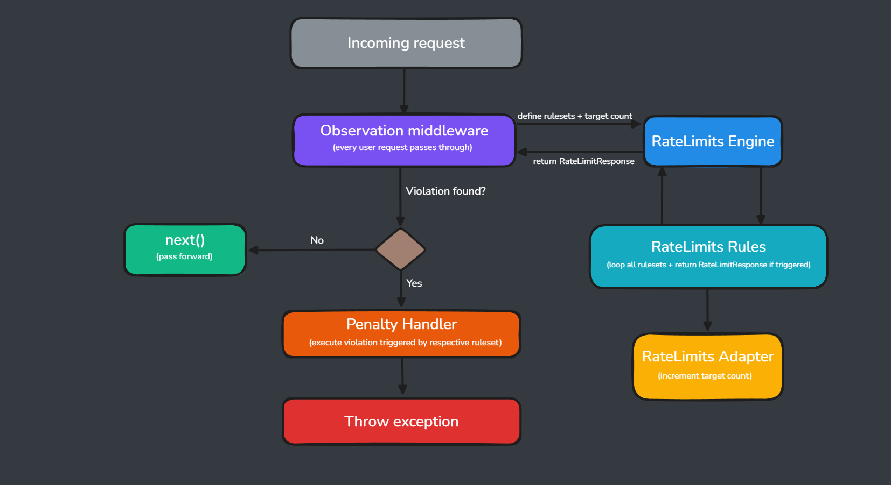
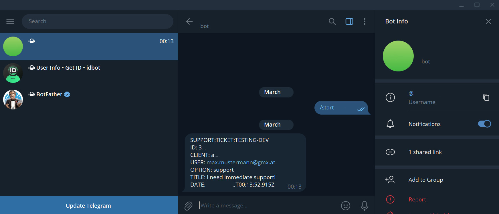

# yqni13 | $\texttt{\color{cornflowerblue}{SUPPORT}}$
### $\textsf{\color{brown}{v1.6.1}}$

#### Support hub - handling feedback/ratings (`/feedback`) and bug/support requests (`/tickets`) including file attachments across multiple applications via REST API. Built with NodeJS (Typescript), Express & PostgreSQL in Docker container using API-Key authentication and rate-limiting. Created following Test-Driven Development (450+ tests) and hosting env:prod via Render, Neon and Cloudflare.

<br>

<div align="center">
    <a href="https://nodejs.org/en"></a>
    <a href="https://expressjs.com/"></a>
    <a href="https://jestjs.io/"></a>
    <a href="https://neon.com/"></a>
    <a href="https://www.docker.com/"></a>
    <a href="https://www.jenkins.io/"></a>
    <a href="https://www.postgresql.org/"></a>
    <a href="https://www.cloudflare.com/de-de/application-services/products/cdn/"></a>
    <a href="https://betterstack.com/"></a>
    <a href="https://testcontainers.com/"></a>
    <a href="https://core.telegram.org/bots/tutorial"></a>
</div>

<br><br>

## 🪄 $\textsf{\color{salmon}Getting started}$


### $\textsf{\color{teal}Prerequisites}$
- node: v22+
- PostgreSQL v17+ (local or hosted like Neon)
- Docker v4.54+
- Cloudflare R2 bucket (file handling)
- Betterstack Telemetry (logging)

<br>

### $\textsf{\color{teal}Local setup}$
Download or clone project
```sh
git clone https://github.com/yqni13/support
```
Create new .env file and fill in your credentials/other env data [(see docs)](./docs/CONFIGURATION.md).<br>
Navigate/cd into project directory ./backend and install dependencies via npm
```sh
npm ci
```
Run migrations [(see docs)](./docs/MIGRATION.md).<br>
Start application in local (development) environment:
```sh
npm run start:dev
```
Alternatively run application in Docker container [(see docs)](./docs/DEVOPS.md).

<br>

## 🧩 $\textsf{\color{salmon}Features}$
| Feature | Description |
|---------|-------------|
| 🪲 Ticket system | Handles support & bug reports per client with status lifecycle and optional file attachments |
| ✨ Feedback & Rating system | Abuse-resistant rating system with atomic aggregate updates - one active rating per user per client |
| 📂 Cloud file handling | Upload/delete via Cloudflare R2 (S3-compatible) - supporting pdf & images up to 1MB each, max 5 per ticket |
| 🔎 Filtered search | Query ticket and user data by properties and/or timespan |
| 🔐 Maintenance Mode | Enable/disable application triggered by request or internal logic |
| 🕵️ Rate limiting | Request throttling with violation handling |
| 🔑 API Key Auth | Client authentication via API keys |
| 📬 Notifications | Admin/Developer notifications on certain events via Telegram bot |

<br>

### $\textsf{\color{teal}Tickets}$

Main focus on this application is the creating and handling of tickets that are used to represent bug reports or support requests. Tickets are authenticated by client (application) and user identifier and hold information in different ways: `title` and `message` are used as the main description, followed by more specific but optional information like `device`, `operational system` and `browser` or optional file attachments that are stored in the cloud.<br>
Tickets use status to signal the process and ensure it doesn't get deleted before solved, canceled or after a certain time when paused. Deleting a ticket also removes the respective files from the cloud that were originally attached.

<br>

### $\textsf{\color{teal}Feedback and Rating}$

User can utilize a feedback & rating system to rate the application in use and send criticism or praise. For every client can exist multiple entries for the entity `Feedback` but only one `FeedbackRating` which holds the accumulated data of the pointing feedback entries.<br>
Resubmissions are handled in the database by an `ON CONFLICT` upsert query [see upsertInTa()](./backend/src/repositories/feedback.repository.ts) on the unique `(client_id, user_id)` constraint, followed by an atomic aggregate update to the 'FeedbackRating' table entry. Both queries are executed within a single transaction to guarantee data consistency.<br>
The rating happens numerical (1-5) and returns an average rating value as number with up to 1 decimal place.<br>
Furthermore, if an existing feedback entry has a message stored, but is not reviewed, the feedback gets NOT updated and request throws a specific exception.

<br>

### $\textsf{\color{teal}File handling}$

User can attach files for any support/bug ticket to provide further information (screenshots, images, ...) on their message. Attachments are limited to upload up to `5` files and each file can be up to `1`MB [see validation](./backend/src/middleware/files/validate.files.middleware.ts). Currently only `images` (webp, jpg, jpeg, png) and `pdf` files are supported, but more will follow. Cloud in use is `Cloudflare` (see `Figure 1`) using S3Client for api communication and files will be deleted when a ticket is closed, canceled or expired (time check).
<div align="center">
    
    Figure 1 - Cloudflare upload demo, v1.0.0
</div>

<br>

### $\textsf{\color{teal}Observation}$

In terms of rate-limiting, penalties and ready-to-extend functionality, the observation middleware takes care of monitoring incoming requests by users and clients (see following workflow or `Figure 2`).<br>

A certain set of rules checks for incoming requests on a total number for the day and within a certain time range. Before the engine returns found violations, the adapter calls for an increment of the daily rate-limit count. Violations are handled by the penalty handler (setting flags/status) and the workflow ends with either throwing an exception or calling next() to pass to the next middleware.
<div align="center">
    
    Figure 2 - observation middleware workflow, v1.0.0-beta.2
</div>

<br>

### $\textsf{\color{teal}Notifications}$

While the support hub can receive requests for bugs, help, or feedback and create tickets based on this data, someone has to be informed of them if further action is necessary. Therefore, a notification service has been implemented to push messages to the responsible admin/developer.<br>
This notification service works with the `Telegram Bot API` by simply creating a bot and sending a custom message (text) with your credentials (`BOT_KEY`, `ADMIN_ID`) to the API:
```sh
private async notify(params: NotificationPostParams) {
    try {
        await axios.post(`https://api.telegram.org/bot${secrets.NOTIFY_BOT_KEY.trim()}/sendMessage`, {
            chat_id: secrets.NOTIFY_ADMIN_ID.trim(),
            text: params.text.trim(),
        });
    } catch(err: any) {
        CommonUtils.logError(params.logMsg, params.logMethod, err);
    }
}
```
Should the notification fail while the rest of the process was successfully executed, the error will only be logged and not thrown as an exception. Telegram can be used on mobile or desktop operating systems and displays notifications as standard messages with the customized text (see Figure 3, for example).<br>
[see Telegram Bot API](https://core.telegram.org/bots/tutorial)

<div align="center">
    
    Figure 3 - Notification via Telegram bot, v1.5.2
</div>

<br>

## 📝 $\textsf{\color{salmon}Logging}$

To monitor errors the logging framework `Winston` is used in combination with Logtail from `Betterstack` as a Singleton: [config](./backend/src/logger/config.logger.ts)
<br>While working within local (DEV) or test environment, error messages are logged into the consoles. For the deployed environments (STAG/PROD) the logging is set to send logtails to Betterstack (longer storage time than app-hosting service). For easy access and monitoring of error messages, the Betterstack UI client dashboard comes in handy (see `Figure 4`). Additional meta data (environment + version numbers) help identifying and assigning errors.
<div align="center">
    
    Figure 4 - Betterstack logging dashboard, v1.0.0-beta.1
</div>

<br>

## 🔧 $\textsf{\color{salmon}Testing}$

### $\textsf{\color{teal}Demo}$

Testing of the application server can be done automatically via Jest tests (next chapter) or manually by a separate demonstration route.<br>POST: `/test/demo`<br>using the body payload to control the response - use the demo route to get exceptions, info message or the current application version number. With the implemented observation middleware, the demo route will be limited to 20 daily requests. As the demo route is not authenticated, you only need the following data:
```sh
[ROUTE] {{url}}/api/v1/test/demo
[PAYLOAD] { "demo_mode": DemoMode }
```
Use `https://support-0hsq.onrender.com` for {{url}} to test on live conditions.<br>
See Figure 5 for the different use cases & responses (Postman, v11.73.5) - from left to right:
<br>[PAYLOAD]: { "mode_enum": "success" } => retrieve current version number as request without fail
<br>[PAYLOAD]: undefined (none) or empty obj/array => retrieve exception for undefined body
<br>[PAYLOAD]: { "mode_enum": "%§$" } => retrieve exception due to invalid value
<br>[PAYLOAD]: { "mode_enum": "error" } => retrieve exception for intended failing db query (see data.message: SEL instead of SELECT)
<div align="center">
    
    Figure 5 - /test/demo responses, v1.3.1
</div>

<br>

POST: `/test/error`<br>
Additionally, the /test route includes a request to manually throw existing exceptions selected by the payload.<br>This route is intended for testing purposes only like UI translations. Therefore, `error` property targets the exception and the optional `errorMsg` controls the message output on certain exceptions.
```sh
[ROUTE] {{url}}/api/v1/test/error
[PAYLOAD] { "error": string, "errorMsg"?: string }
```


<br>

### $\textsf{\color{teal}Jest}$

Added `jest` testing framework to project providing unit tests and integration tests for the `backend`.<br>
Install the packages `@jest/globals`, `@types/jest`, `supertest`, `@testcontainers/postgresql` and `testcontainers` additional to `jest`:
```sh
npm install jest @jest/globals @types/jest supertest @testcontainers/postgresql testcontainers --save-dev
```
`450+ tests` exist currently for models, utils, validators and workflows (integration tests) - [see tests](./backend/tests).<br>
Integration-Tests can only run with `active Docker service` due to the ephemeral (temporary) database by testcontainers.<br>
Run tests on local device by including setup for dotenv/config to provide environment variables:
```sh
set NODE_ENV=test && jest --setupFiles dotenv/config
```
or simply save as script command in `package.json` to run `npm test`:
```sh
"scripts": {
    "start:dev": "ts-node --files src/server.ts",
    "test": "set NODE_ENV=test && jest --setupFiles dotenv/config"
}
```

<br>

To automatically check tests before merging feature/development branch further up, a `GitHub Action` is set up, see [main.yml](.github/workflows/main.yml).<br>
Preventing an unwanted merge with unfinished/failed test run, the project is set up to disable merging until all tests have passed (see Figure 6 to Figure 7).

<div align="center">
    
    Figure 6 - processing tests, v0.9.1
</div>
<br>
<div align="center">
    
    Figure 7 - passing tests, v0.9.1
</div>

<br>

## 📈 $\textsf{\color{salmon}Updates}$
[see changelog for all updates](/docs/CHANGELOG.md)


$\textsf{[v1.6.0\ =>\ {\textbf{\color{brown}v1.6.1}]}}$ app<br>
- $\textsf{\color{orange}Patch:}$ Updated interfaces to remove "I" prefix and remove usages of "any" type.

<br>

### Update objectives:
<d>
    <dd>- caching layer</dd>
    <dd>- background worker</dd>
    <dd>- jenkins setup</dd>
</d